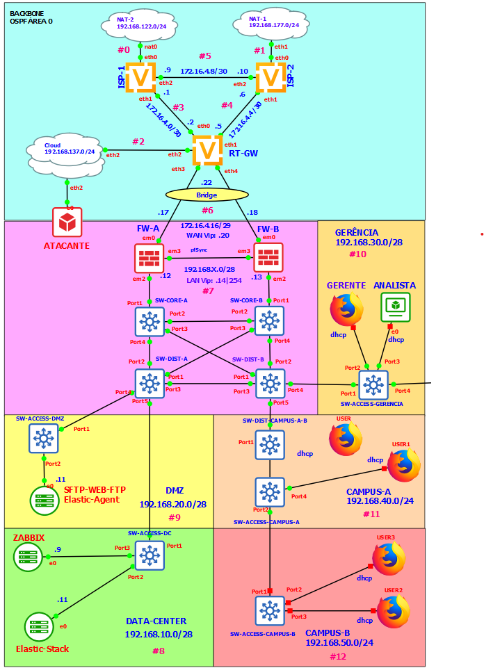

# How to Create a Network Security Operation Center ( NSOC ) With GNS3.

## This project is a guide to create a simple NSOC with GNS3

Este trabalho foi apresentado como Projeto Final da Matéria de Redes de Comunicação do Programa de Pós-Graduação em Enenharia Elétrica ([PPEE](https://ppee.unb.br/)) do Departamento de Engenharia Elétrica (ENE) da Universidade de Brasília.

Trabalho realizado com a supervisão do [Prof. Dr. Georges Daniel Amvame Nze](https://ppee.unb.br/?page_id=128)

Confira o trabalho completo no link:  
[Projeto Final Completo.pdf](https://github.com/KeystoneDevBr/NSOC-With-GNS3/blob/main/Projeto-Final-Completo.pdf)

A Imagem a seguir ilutra a Topologia de Rede do NSOC desenvolvido ao longo do Projeto Final.

[id/name]: http://link-url/