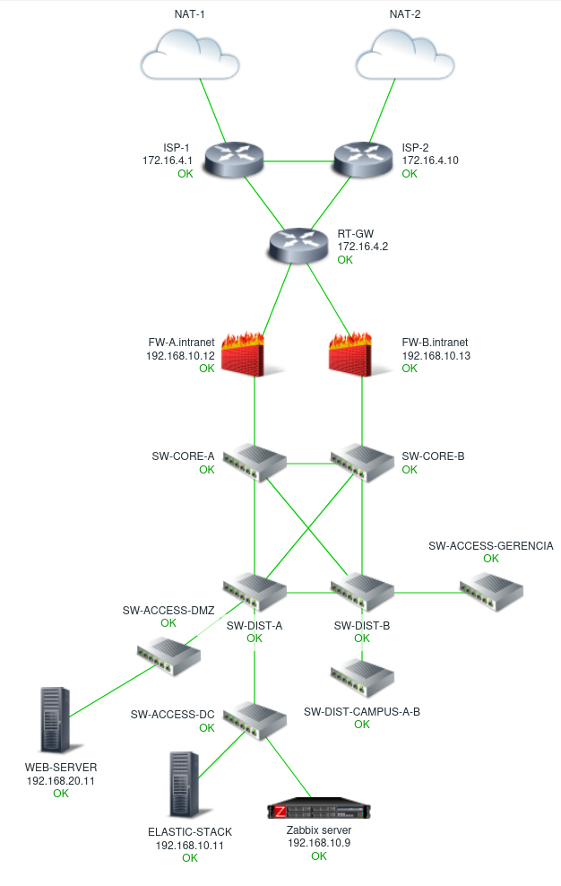

# How to Create a Network Security Operation Center ( NSOC ) With GNS3.

## This project is a guide to create a simple NSOC with GNS3

Este trabalho foi apresentado como Projeto Final da Matéria de Redes de Comunicação do Programa de Pós-Graduação em Enenharia Elétrica ([PPEE](https://ppee.unb.br/)) do Departamento de Engenharia Elétrica (ENE) da Universidade de Brasília.

Trabalho realizado com a supervisão do [Prof. Dr. Georges Daniel Amvame Nze](https://ppee.unb.br/?page_id=128)

Confira o trabalho completo no link: [Projeto Final Completo.pdf](https://github.com/KeystoneDevBr/NSOC-With-GNS3/blob/main/Projeto-Final-Completo.pdf)

A imagem a seguir ilustra a Topologia de Rede do NSOC desenvolvido ao longo do Projeto Final.

A imagem a seguir ilustra o monitoramento da rede do NSOC via Zabbix.

## Configurações do Projeto

As configurações do projetos estão dosponíves no item 8 do Projeto Final (8. RELAÇÕES DE APÊNDICES).

Os scripts referentes a cada Apêndice poderão ser encontrados nos links a seguir: 

[Apêndice I - Instalação e Configuração Inicial da Plataforma GNS3.](./anexos/Apêndice%20I%20-%20Instalação%20e%20Configuração%20Inicial%20da%20Plataforma%20GNS3.pdf)

[Apêndice II - Instalação e Configuração dos Roteadores VyOS](./anexos/Apêndice%20II%20-%20Instalação%20e%20Configuração%20dos%20Roteadores%20VyOS.sh)

[Apêndice III- Instalação e Configuração Inicial do Firewall pfSense](./anexos/Apêndice%20III-%20Instalação%20e%20Configuração%20Inicial%20do%20Firewall%20pfSense.sh)

[Apêndice IV - Instalação e Configuração do Switch EXOS VM](./anexos/Apêndice%20IV%20-%20Instalação%20e%20Configuração%20do%20Switch%20EXOS%20VM.sh)

[Apêndice V - Instalação e Configuração do Servidor Modelo Ubuntu Server 22.04 LTS](./anexos/Apêndice%20V%20-%20Instalação%20e%20Configuração%20do%20Servidor%20Modelo%20Ubuntu%20Server%2022.04%20LTS.sh)

[Apêndice VI - Instalação e Configuração da Solução com Dialog Para Gerenciamento das Máquinas Virtuais Ubuntu](https://github.com/KeystoneDevBr/app_dialog.d)

[Apêndice VII - Instalação e Configuração da Solução Ping com Dialog](https://github.com/KeystoneDevBr/encrypted-ping)

[Apêndice VIII - Instalação e Configuração do Servidor Web, FTP/SFTP e Fleet Server](./anexos/Apêndice%20VIII%20-%20Instalação%20e%20Configuração%20do%20Servidor%20Web,%20FTP%20-%20SFTP%20e%20Fleet%20Server.sh)

[Apêndice IX - Instalação e Configuração Inicial do Servidor Zabbix](./anexos/Apêndice%20IV%20-%20Instalação%20e%20Configuração%20do%20Switch%20EXOS%20VM.sh)

[Apêndice X - Instalação da Elastic Stack](./anexos/Apêndice%20X%20-%20Instalação%20da%20Elastic%20Stack.sh)

[Apêndice XI - Detalhamento da Topologia do Projeto Final](./imgs/topologia.png)

