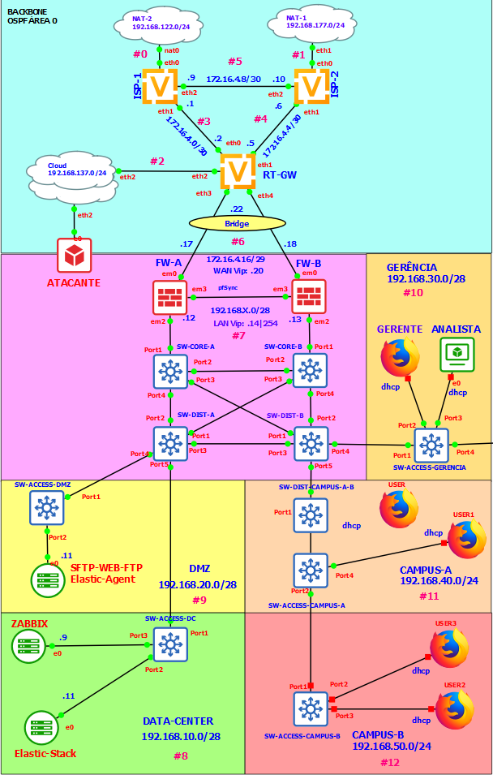

# How to Create a Network Security Operation Center ( NSOC ) With GNS3.

## This project is a guide to create a simple NSOC with GNS3

Este trabalho foi apresentado como Projeto Final da Matéria de Redes de Comunicação do Programa de Pós-Graduação em Enenharia Elétrica ([PPEE](https://ppee.unb.br/)) do Departamento de Engenharia Elétrica (ENE) da Universidade de Brasília.

Trabalho realizado com a supervisão do [Prof. Dr. Georges Daniel Amvame Nze](https://ppee.unb.br/?page_id=128)

Confira o trabalho completo no link:  
[Projeto Final Completo.pdf](https://github.com/KeystoneDevBr/NSOC-With-GNS3/blob/main/Projeto-Final-Completo.pdf)

A Imagem a seguir ilutra a Topologia de Rede do NSOC desenvolvido ao longo do Projeto Final.

## Configurações do Projeto

As configurações do projetos estão dosponíves no item 8 do Projeto Final (8. RELAÇÕES DE APÊNDICES).

Os scripts referentes a cada Apêndice poderão ser encontrados nos links a seguir: 

[Apêndice I - Instalação e Configuração Inicial da Plataforma GNS3.](./anexos/Apêndice%20I%20-%20Instalação%20e%20Configuração%20Inicial%20da%20Plataforma%20GNS3.pdf)
[Apêndice II - Instalação e Configuração dos Roteadores VyOS]()
[Apêndice III- Instalação e Configuração Inicial do Firewall pfSense]()
[Apêndice IV - Instalação e Configuração do Switch EXOS VM]()
[Apêndice V - Instalação e Configuração do Servidor Modelo Ubuntu Server 22.04 LTS]()
[Apêndice VI - Instalação e Configuração da Solução com Dialog Para]()[Gerenciamento das Máquinas Virtuais Ubuntu]()
[Apêndice VII - Instalação e Configuração da Solução Ping com Dialog]()
[Apêndice VIII - Instalação e Configuração do Servidor Web, FTP/SFTP e Fleet Server]()
[Apêndice IX - Instalação e Configuração Inicial do Servidor Zabbix]()
[Apêndice X - Instalação da Elastic Stack]()
[Apêndice XI - Detalhamento da Topologia do Projeto Final]()

